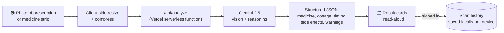

<div align="center">

# 🩺 DawaDoc

**Turn a confusing handwritten prescription into a plain-language explanation — in seconds.**

Built for elderly parents and the family members who look after them.

[**Live app →**](https://dawadoc.vercel.app)


</div>

---

## The problem

Handwritten Indian prescriptions are notoriously hard to read. Most elderly patients end up
trusting the pharmacist blindly — they can't independently check what a medicine is for, when
to take it, or what side effects to watch for. **DawaDoc closes that gap**: photograph a
prescription or a medicine strip, and get it explained back in plain Hindi or English, read
aloud if needed.

## ✨ Features

| | |
|---|---|
| 📷 **Snap or upload** | Take a photo with your camera, or upload one from your gallery |
| 🤖 **AI that reads messy handwriting** | Powered by Gemini's vision model — built for the notoriously hard-to-read handwriting on Indian prescriptions |
| 🗣️ **Hindi or English, read aloud** | Every explanation is available in simple Hindi or English, with one-tap text-to-speech |
| ⏰ **Clear dosage timing** | Before food, after food, morning/night — laid out visually, not buried in jargon |
| ⚠️ **Side effects to watch for** | A short, relevant list — not an overwhelming package insert |
| 🔐 **Optional Google sign-in** | Use it instantly with no account, or sign in to save your scan history |
| 🕘 **Scan history** | Signed-in users get their past scans (only successful ones) grouped by date, in a collapsible sidebar |
| 🌗 **Light & dark themes** | Full theme support, remembered across visits |
| 👋 **Guided first-time tour** | A low-friction onboarding walkthrough for first-time users, replayable anytime |
| ⚕️ **Honest about its limits** | Always encourages confirming with a real doctor or pharmacist — this is an explanation tool, not medical advice |

## 🏗️ How it works



The Gemini API key never reaches the browser — every analysis request goes through a serverless
function that holds the key server-side.

## 🧱 Tech stack

- **Frontend** — React 19, TypeScript, Vite, Tailwind CSS 4
- **AI** — Google Gemini (`gemini-flash-latest`) for combined OCR + vision + plain-language
  explanation in one call
- **Auth** — Firebase Authentication (Google sign-in)
- **Data** — Scan history is currently stored in the browser's `localStorage`, keyed per signed-in
  user (see Roadmap below for the planned Firestore sync)
- **Voice** — Browser-native Web Speech API (zero cost, no extra API)
- **Hosting** — Vercel (static frontend + serverless `/api` functions), connected to this repo
  for auto-deploys on push

## 🚀 Getting started

```bash
git clone https://github.com/dhrubagoswami/DawaDoc.git
cd DawaDoc
npm install
cp .env.example .env   # then fill in the values below
```

### Environment variables

| Variable | Where to get it |
|---|---|
| `GEMINI_API_KEY` | Free at [aistudio.google.com/apikey](https://aistudio.google.com/apikey) |
| `VITE_FIREBASE_API_KEY` | [Firebase Console](https://console.firebase.google.com) → Project settings → Your apps → Web app config |
| `VITE_FIREBASE_AUTH_DOMAIN` | same as above |
| `VITE_FIREBASE_PROJECT_ID` | same as above |
| `VITE_FIREBASE_STORAGE_BUCKET` | same as above |
| `VITE_FIREBASE_MESSAGING_SENDER_ID` | same as above |
| `VITE_FIREBASE_APP_ID` | same as above |

Firebase config values are not secret (they're meant to ship in client code), but they do need
**Google sign-in enabled** under Authentication → Sign-in method in your Firebase project.

### Run locally

```bash
npm run dev
```

This starts Vite with a built-in dev middleware that proxies `/api/analyze` locally, so the full
flow — upload, Gemini analysis, auth, history — works without needing the Vercel CLI.

### Build & lint

```bash
npm run build   # type-check + production build
npm run lint    # oxlint
```

## 📁 Project structure

```
DawaDoc/
├─ api/analyze.ts          # Vercel serverless function (Gemini call)
├─ server/analyzeHandler.ts # Shared analysis logic (used by both prod + local dev)
├─ src/
│  ├─ pages/               # LandingPage, ScanPage, ProfilePage
│  ├─ components/          # UI building blocks (cards, dialogs, nav controls…)
│  └─ lib/                 # Hooks, i18n copy, Firebase/Gemini clients
└─ vite.config.ts          # Includes the local dev API middleware
```

## 🌍 Deployment

The `main` branch auto-deploys to Vercel on every push. To set up your own:

1. Import this repo at [vercel.com/new](https://vercel.com/new)
2. Add all environment variables above under Project Settings → Environment Variables
   (Production + Preview)
3. Add your Vercel domain to Firebase Authentication → Settings → Authorized domains

## ⚕️ Disclaimer

DawaDoc explains what's written on a prescription or medicine label — **it is not medical
advice**. Always confirm with a doctor or pharmacist before making any decisions.

## 🗺️ Roadmap

- [ ] Sync scan history to Firestore (currently `localStorage`, per device) — a Firestore
      database and security rules restricting each user to their own data are already
      provisioned for this
- [ ] Share scan findings with family members (read-only)
- [ ] Support for more Indian languages beyond Hindi/English
- [ ] Photo storage for full scan history (currently thumbnails only)

---

<div align="center">
<sub>Built to help families read prescriptions together.</sub>
</div>
